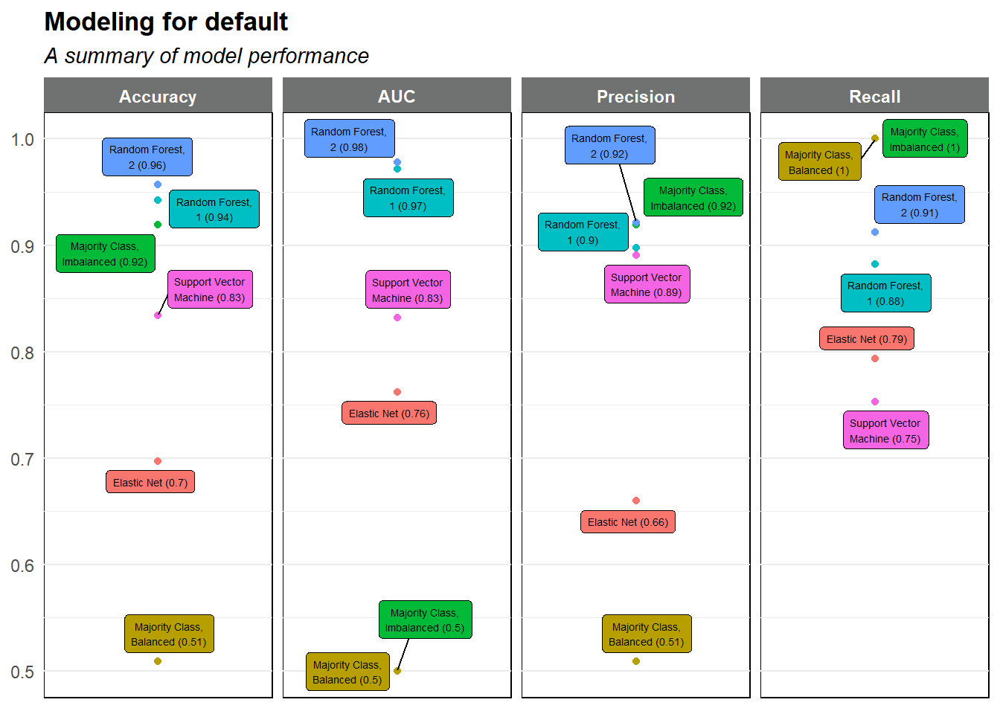
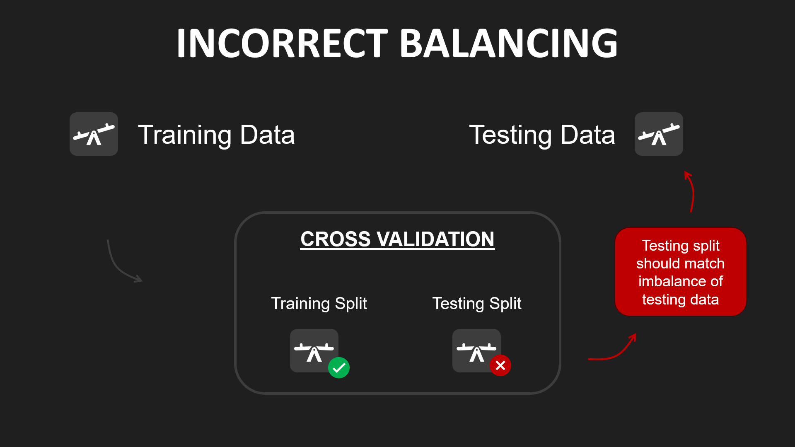

# Predicting Likelihood of Default

This project is about expanding Home Credit's product offering to individuals with limited access to traditional financial resources by predicting likelihood of default using standard application and 3rd party data. 

This project features analytical workflows in data wrangling, data analysis, and data science. It is a sponsored project in the Capstone #2 (IS 6812) course, part of the Eccles Business School Masters of Science Business Analytics graduate program.

To review this work in detail, see my [personal notebooks](https://adambushman.github.io/home-credit-default-risk-individual/) and [team notebooks](https://adambushman.github.io/home-credit-default-risk-group/).

---

## Table of Contents

1. [Summary](#summary)
2. [Group Solution](#group-solution)
3. [Business Value](#business-value)
4. [My Contribution](#my-contribution)
5. [Challenges & Growth](#challenges-and-growth)
6. [Documentation](#documentation)

---

## Summary

### Business Problem

The United States financial landscape is plagued by what is known as a "Dual Credit Market". On the predictable end are traditional banks, credit unions, etc., while on the other exist more predatory avenues, such as payday lenders, pawn shopes, check cashiers, etc. Geography, race, ethnicity, and other factors contribute to this line of delineation.

Home Credit looks to bridge this accessibility gap by unearthing worthy applicants without credit history. This is a challenge and opportunity as credit history is *the* determining factor for which of the "dual credit markets" a client may turn. 

### Project Objective

Develop a machine learning model to predict "default" for traditional credit history applicants **and** those without. To do this, non-applicant data is provided as a means to supplement the predictors. 

As this is a project sourced from Kaggle, the goal is also to design a model performant enough to score in the 0.70-0.80 for *area under the ROC curve* (AUC).

## Group Solution

### Approach

Individually, our team explored the data and looked for predictive patterns therein. The data sets spanned 7 files, most of which boasted 1-3 million rows and upwards of 100+ columns. 

We took to modeling the data for "default", practicing reproducible data science with notebooks and code repositories. We explored 3 models, an elastic net (penalized logistic regression), a support vector machine (SVM), and a random forest. 

Each model used balanced target class data sets and was hyperparameter tuned using cross-validation. Each boasted improved results over the majority class classifier in a handful of metrics. We visualized the performance results as such:

### Key Deliverables

Our final model was a random forest variant that specifically performed well in precision, or avoidance of the type-1 error. Additionally, the model appeared to deliver excellent accuracy (0.96) and AUC (0.98). 

This model appeared to address Home Credit's need perfectly. Upon training the final model and fitting it to a testing dataset, we found results paled in comparison (AUC of ~0.61). Using the support vector machine yieled an AUC of ~0.67, still a far cry from the 0.83 we saw in cross validation.

Clearly something went awry. More on that below.

## Business Value

### Immediate Benefits

The model "as-is" is *NOT* recommended for immediate use due to the performance gap in training and testing scenarios. There exist two straight-forward steps for resolving this concern:

- Apply *SMOTE* to just the training splits during cross-validation, thereby testing against imbalanced data

- Leverage some of the supplemental data sources explored during the EDA portion

We're confident that after resolving these components Home Credit would see increased application acceptance among the "underserved" cohort.

### Long-term Value

By achieving Home Credit's goal of increasing access of financial products to those individuals with little to no credit history, the company will 1) reduce default rates with more accurate predictions, 2) reduce the "dual credit market" problem in the US, and 3) increase profits via loan interest capture.

## My Contribution

My involvement in the project was comprehensive from start to finish, spanning the following areas:

- **Exploratory Data Analysis:** my work in exploring the raw data led to insights about column groups without predictive power and avenues for identifying the "underserved" (little to no credit history) cohort of applicants.

- **Target Class Balancing:** I explored and learned about balancing techniques, choosing to leverage *SMOTE* (Synthetic Minority Oversampling Technique); I coded up the pipeline for recurrent use.

- **Modeling:** I took lead on exploring penalized logistic regression and support vector machine models, using hyperparameter tuning with cross-validation for optimal results.

- **Coordination:** in partnership with other group members, I strived for consistent and quality coordination and collaboration in all efforts of the project.

## Challenges and Growth

### Challenges

- **Results Troubleshooting**: our team struggled with interpreting the performance drop-off between cross-validation and final fitting to test data. Upon greater research, we discovered that our implementation of *SMOTE* in the cross-validation testing splits was wrong. Testing splits must match the imbalance of test data.

### Areas of Growth

- **GitHub:** our team worked hard to practice industry standard practices for code collaboration through GitHub. We protected the repository against force commits to `/main` and implemented pull requests and reviews from other code members. 

- **Skepticism:** our group learned a valuable lesson to deploy a heavy dose of skepticism when models produce as of great results as we saw during this project. Had we investigated this phenomena earlier, we could have rectified the issue while we still had time.

- **Coordination:** for much of the project, the group was comprised of myself and one other individual. We had to collaborate often and shoulder a large workload between the two of us. Upon eventual involvement of the final team member, we worked hard to get them integrated and up to speed. It confirmed the need for robust documentation.

## Documentation

- **Final Submission**:
  - Project summary:
  [raw code](https://adambushman.github.io/home-credit-default-risk-group/models/final-model/Random-Forest---Test-Set.html)
  - Final model: 
  [rendered notebook](https://adambushman.github.io/home-credit-default-risk-group/models/final-model/Random-Forest---Test-Set.html), 
  [raw code](https://github.com/adambushman/home-credit-default-risk-group/blob/main/models/final-model/Random%20Forest%20-%20Test%20Set.Rmd)
- **Model Exploration**: 
  - Performance Results:
  [rendered notebook](), 
  [raw code]()
  - Random Forest: 
  [rendered notebook](https://adambushman.github.io/home-credit-default-risk-group/models/random-forest/Random-Forest.html), 
  [raw code](https://github.com/adambushman/home-credit-default-risk-group/blob/main/models/random-forest/Random%20Forest.Rmd)
  - Support Vector Machine: 
  [rendered notebook](https://adambushman.github.io/home-credit-default-risk-group/models/support-vector-machine/Adam%20Modeling.html), 
  [raw code](https://github.com/adambushman/home-credit-default-risk-group/blob/main/models/support-vector-machine/Adam%20Modeling.qmd)
  - Elastic Net:
  [rendered notebook](https://adambushman.github.io/home-credit-default-risk-group/models/penalized-regression/Adam%20Modeling.html), 
  [raw code](https://github.com/adambushman/home-credit-default-risk-group/blob/main/models/penalized-regression/Adam%20Modeling.qmd)
  - Majority Class Classifier:
  [rendered notebook](https://adambushman.github.io/home-credit-default-risk-group/models/majority-class-baseline/Adam%20Modeling.html), 
  [raw code](https://github.com/adambushman/home-credit-default-risk-group/blob/main/models/majority-class-baseline/Adam%20Modeling.qmd)
- **EDA & Wrangling**:
  - Data Wrangling:
  [raw code](https://github.com/adambushman/home-credit-default-risk-group/blob/main/Data%20Cleaning.Rmd)
  - Exploratory Data Analysis:
  [rendered notebook](https://adambushman.github.io/data-science-projects/full-projects/home-credit-default-risk/python/eda_adam-bushman.html),
  [raw code]()

## Acknowledgments

-   Thank you to Home Credit and user Anna Montoya for the competition sponsorship through [Kaggle](https://www.kaggle.com/competitions/home-credit-default-risk/data?select=HomeCredit_columns_description.csv)

## Resources

[R](https://www.r-project.org/)

[Python](https://www.python.org/)

[SciKit-Learn](https://scikit-learn.org/stable/)

[StatsModels](https://www.statsmodels.org/stable/index.html)

[DuckDB](https://duckdb.org/)