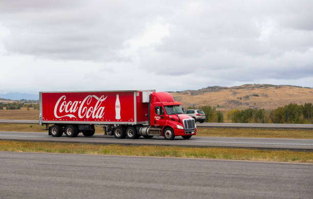
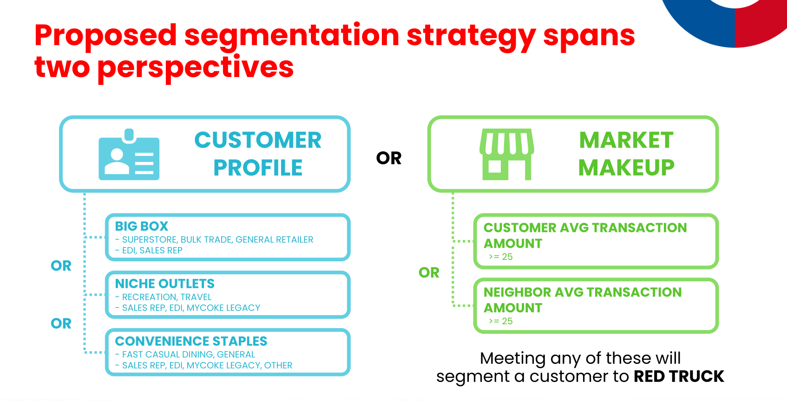
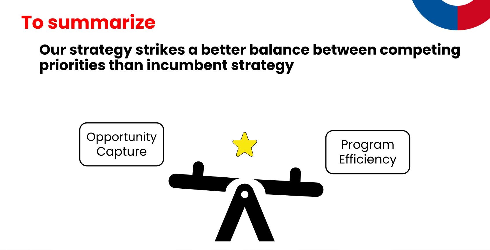

  

 

# Delivery Model Standardization for Swire Coca-Cola

Swire Coca-Cola (SCCU) operates under two distribution models: “Red Truck” for high-volume customers serviced directly by Swire, and “White Truck” or “Alternate Route to Market” for smaller customers served by third-party distributors.

This project is about identifying improvements over Swire's incumbent segmentation strategy (400-gallon threshold) by analyzing customer characteristics and ordering behaviors to support long-term success.

This project features analytical workflows in data wrangling, data analysis, and data science. It is a sponsored project in the Capstone #3 (IS 6813) course, part of the Eccles Business School Masters of Science Business Analytics graduate program.

To review this work in detail, see my [personal notebooks]().

---

## Table of Contents

1. [Summary](#summary)
2. [Group Solution](#group-solution)
3. [Business Value](#business-value)
4. [My Contribution](#my-contribution)
5. [Challenges & Growth](#challenges-and-growth)
6. [Documentation](#documentation)
7. [Acknowledgments](#acknowledgments)

---

## Summary

### Business Problem

Regional beverage bottler Swire Coca-Cola (SCCU) relies on two business models: 1)
“Red Truck”, which features high-volume customers serviced personally by Swire,
and 2) “White Truck” or “Alternate Route to Market”, which entails smaller customers
serviced by a third-party distributor.

Swire aims to better algin their customers with the business proposition of these models by
identifying customer characteristics and ordering behavior that better determines
the right business model for the long-term relationship.

### Project Objective

Develop an alternative segmentation strategy that better balances two priorities: 1) capture of future opportunity and 2) preserves an efficient RED TRUCK program. These two are naturally opposed.

Measures of success include:

* Future volume retained in RED TRUCK
* RED TRUCK program efficiency (volume per fixed delivery costs)
* Future opportunity cost of routing to WHITE TRUCK
* Future delivery cost savings
* Future labor hour savings

## Group Solution

### Approach

Individually, our team explored the individual files, uncovered considerations for cleaning the data, and analyzed a wrangled version thereof. 

We took to exploring a variety of solutions, including unsupervised clustering, forecasting, supervised learning of annual volume, etc. We knew ahead of time that none of these solutions would be used as-is. However, they were important avenues for our study of the business problem.

Through much collaboration, brainstorming, comparison of results, and productive debate, we settled on the most powerful insights that would ultimately lead us to our proposal:

* Annual volume is a noisy measure for RED TRUCK material as a majority of customers qualifying under the incumbent strategy did so via a high touch, inefficient ordering method
* Customer characteristics do well to predict segmentation independent of the target volume threshold, indicating they should play a key role in the strategy
* Market dynamics are an important component and summarizing the performance of the closest neighboring customers does well to approximate local market conditions

### Key Deliverables

Our work culminated in a proposed segmentation strategy featuring nuanced rules about a customer's profile and their segmentation. Specifically, a customer would qualify for each program if they met any of the following conditions:

  
  

Our solution resulted in 18K customers, representing 88% of the annual volume. Additionally, the average customer we segmented to RED TRUCK boasts an average transaction amount 70% higher than the average WHITE TRUCK customer. Likewise, the average RED TRUCK customer's neighbor generates 40% higher annual volume than an average WHITE TRUCK customer's neighbor.

## Business Value

We felt it was important to benchmark our segmentation strategy against the incumbent strategy. Specifically, we look to capture measures that highlight how our solution better balances the two priorities in the business problem.

  

We found this strategy to retain 56% more volume in 2025 than the incumbent strategy, while achieving 86% of the incumbent strategy's RED TRUCK program efficiency, defined as 2025 volume per $100 of delivery costs.

## My Contribution

My involvement in the project was comprehensive from start to finish, spanning the following areas:

- **Exploratory Data Analysis:** My analysis approaches helped the team figure out how to combine, clean, and standardize the data sets. Speficially, I lead the effort in figuring out how to properly leverage the delivery cost data.

- **Customer Neighbors:** My work was instrumental in the idea of approximating market conditions through the lense of the 5 nearest neighboring customers. I used the Haversine forumla to identify these neighbors for each customer and summarized their performance.

- **Clustering:** I explored two clustering approaches: kmeans and hierarchical. These approaches helped to confirm the work from other team members that customer profile characteristic combinations were to feature in our proposal.

- **Presentation:** I really pushed the team to sharpen the presentation, simplify, and use less text and more visuals. While this is perhaps my preference, we all felt that our presentation captured the real signal of our message and limited the amount of noise that could have distracted or confused.

- **GitHub Repository:** Having relied heavily on documentation of tools, projects, etc, in my personal and professional work, I heartily believed a polished repository could be even more important to Swire's ability to harness our work than the presentation itself. Therefore, I spent extra time documenting, simplifying, and organizing the repository to make it simple to leverage our work.

## Challenges and Growth

### Challenges

- **Abstract Business Problem**: We found this project to be quite challenging given the abstract nature of the requested solution. "Improvements over what we're currently doing" isn't as straight forward as a commonplace regression problem. It turned into a real study, an exercise in exploration of the spectrum of solutions.

### Areas of Growth

- **Pushing Past Insights:** Each member of our group saw real growth in pushing past nuanced insights and arriving to business impacting proposals. On my part, I was pleased with my improved ability to graduate my thinking to a higher plane of what will truly give the business traction.

- **Pooling Results:** Our work felt siloed at times and concentrated around the margins when looking individually. It was our collaboration and pooling the results that revealed powerful business insights and propelled us to a proposal.

- **Presenting:** Our team worked hard on the presentation. We focused particularly on tuning in to the "signal". The more we reviewed our work and what we actually wanted to say, we found a lot of "noise" that could have crept into the presentation and muddied our message. We felt proud of our work to simplify our insights, proposal, and impact.

## Documentation

On April 9th, our team presented to Swire staff, MSBA guides, and fellow Capstone participants. We shared insights, a proposed segmentation strategy, and our estimates for the business potential our solution has over the incumbent strategy.

To complete the project, we shared a repository with comprehensive documentation, source code files, and all presentation resources with Swire staff. We feel confident in delivering an impactful, creative solution to Swire.

## Acknowledgments

-   Thank you to Swire Coca-Cola staff for facilitating the project, supporting our work, and allowing us to present our solution in person.
-   Tremendous gratitude to the MSBA guides, Jeff Webb and David Agogo, who's tireless work to support, advise, and encourage us throughout the process.
-   Much appreciation to my fellow project team members: Georgia, Tyler, and Zac. Their collaboration, commitment, ingenuity, and support made the project a resoundingly successful experience.

## Resources

[R](https://www.r-project.org/)

[Python](https://www.python.org/)

[Tidyverse](https://www.tidyverse.org/)

[Tidymodels1](https://www.tidymodels.org/)

[DuckDB](https://duckdb.org/)